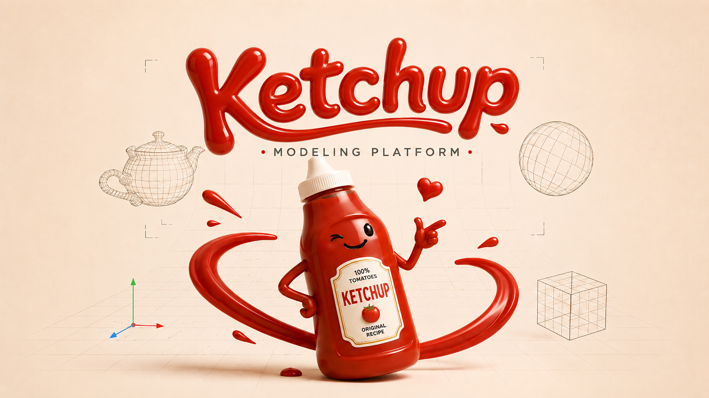

# Ketchup

  

Ketchup is an open-source, AI-native 2D/3D parametric modeler focused first on architecture, interiors, and furniture. The project targets fast direct interaction, exact geometry, deterministic canonical commands, and an optional AI assistant that cannot bypass validation or confirmation.

## Current phase

Ketchup is an **active development prototype**, not a released general-purpose CAD system. The repository has progressed beyond R0 through the canonical manual modeler, exact-worker integration, bounded beam and bottle workflows, safe AI/extension surfaces, and a shared exact feature/result path. The current M9 work adds canonical rule-to-feature parameter bindings and an explicit deterministic recompute command through `apply_batch`; Save/Open remains observational and never silently recomputes canonical values.

Verified narrow paths now include:

- immutable canonical revisions, atomic command batches, one-step Undo/Redo, typed definitions/features/occurrences/groups, and schema-versioned persistence;
- exact profile/extrusion/boolean workflows with revision-bound results, render/pick references, and export views;
- bounded joint-driven timber half-laps and an editable rotational bottle workflow;
- authoritative Proposal validation, a constrained external Python SDK/plugin path, and fail-closed validator hosting;
- canonical parameter bindings with evaluator/backend-bound command identity, atomic explicit recompute, and no Open-time mutation.

These are bounded, tested vertical slices. Broad CAD operation coverage, full FLP validation, general file-format compatibility, and release certification are still incomplete.

## Project baselines

- License: Apache-2.0
- Initial platform: Windows
- Core direction: Rust with Open CASCADE Technology behind a narrow C++ facade
- Rendering direction: `wgpu`
- Privacy: local-first; cloud AI only after explicit operation or workspace opt-in
- Capacity: project owner plus AI agents, with no guaranteed additional human FTE

## Language and localization

Technical documentation, code, identifiers, schemas, tests, and commit messages are English. The initial UI is English, but all user-facing copy must use localization keys and resources from the first widget; see [ADR 0001](docs/adr/0001-project-language-and-localization.md).

## Architecture and execution authority

Use the project documents in this order:

1. [Accepted ADRs](docs/adr) for the decisions they own. The latest accepted implementation consequences are [ADR 0004](docs/adr/0004-v4-p15-sequence-and-a0-disposition.md), [ADR 0005](docs/adr/0005-no-go-diagnostic-hold.md), [ADR 0006](docs/adr/0006-canonical-and-derived-result-write-paths.md), and [ADR 0007](docs/adr/0007-windows-x86-64-first-release.md).
2. The frozen [Architecture V3 Execution Contract](docs/architecture/EXECUTION_CONTRACT.md) for binding product scope, invariants, gate order, and metrics.
3. [Architecture Specification V4c](KETCHUP_ARCHITECTURE_SPECIFICATION_V4c.md) as the latest consolidated as-built/target review document. Its post-V3 proposals remain non-binding until ratified by ADR, exactly as its status and precedence section state.
4. The [interaction specification](docs/design/README.md) and accepted [workflow-led implementation plan](docs/design/IMPLEMENTATION_PLAN.md) for UI behavior and implementation order.

Historical gate evidence remains historical and is never rewritten by later implementation. The original [R0-to-FLP mission manifest](docs/missions/ketchup-r0-to-flp_manifest.md), [R0 baseline](R0_LICENSE_AND_TOOLCHAIN_BASELINE.md), and [Windows toolchain guide](docs/toolchain/WINDOWS.md) remain available for provenance and reproduction.

No stable public API or native file-format compatibility is promised at this stage.
