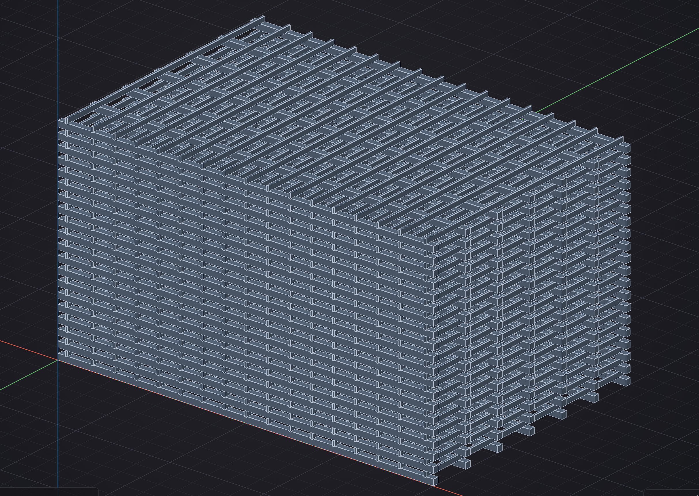

# Ketchup

<p align="center">
  
</p>

Ketchup is an open-source, AI-native 2D/3D parametric modeler focused first on architecture, interiors, and furniture. It combines fast direct interaction, exact geometry, deterministic canonical commands, and a constrained AI assistant that cannot bypass validation or undo history.

## Current status

Ketchup is a **working development prototype**, not yet a general-purpose CAD release. The application now has a coherent desktop modeling shell, versioned documents, exact and mesh geometry, interactive editing workflows, and an optional conversational assistant. The current tree is substantially beyond an architectural concept, while broad CAD coverage, installers, compatibility guarantees, and release certification remain in progress.

<p align="center">
  
</p>

### What works today

- A GPU-rendered 3D viewport with orbit, pan, zoom, projection controls, hover, selection, snapping, and large instanced scenes.
- Canonical rectangle, circle, arc, extrusion/push-pull, move/copy, grouping, components, Make Unique, visibility, measurement, and Undo/Redo workflows.
- Exact-worker integration for profile, extrusion, boolean, sweep, loft, revolve, shell, fillet, chamfer, planar offset, and bounded product workflows.
- Definitions, occurrences, groups, features, transforms, stable references, immutable revisions, and atomic command batches.
- Versioned `.ketchup` documents with New/Open/Save/Save As and failure-safe persistence.
- English, Slovak, and pseudo-locale UI resources, keyboard access, multiple visual themes, and an offscreen AccessKit test harness.
- A conversational AI sidecar with bounded document context, CAD-only tools, protocol limits, cancellation, validation, and undoable canonical changes. Public builds use explicit API-key providers; private OAuth support remains a separate build feature.
- A constrained external Python SDK/plugin path and fail-closed validator hosting.

These are tested vertical slices, not a promise that every CAD operation or imported file will work.

## Try the sample scene

[`examples/grooved-beam-array.ketchup`](examples/grooved-beam-array.ketchup) is the 480-occurrence timber assembly shown above. It contains both exact-worker bodies and canonical mesh bodies and is useful for trying viewport navigation, hover, selection, Outliner behavior, and large-scene responsiveness.

Open it with **File → Open** after launching Ketchup.

## Build and run

The current supported development platform is Windows x86-64 with the pinned Rust toolchain and native dependencies described in the [Windows toolchain guide](docs/toolchain/WINDOWS.md).

```powershell
cargo build -p ketchup-scheduler --bin ketchup-exact-worker
cargo run -p ketchup-app
```

For the full locked validation suite:

```powershell
cargo test --locked --workspace --all-targets -- --test-threads=1
cargo clippy --workspace --all-targets --all-features -- -D warnings
cargo fmt --all -- --check
```

No stable public API or native file-format compatibility is promised at this stage.

## AI safety model

The Assistant does not mutate the document through a privileged back door. UI actions, plugins, scripts, and AI proposals converge on the same versioned command and validation path. Changes are revision-bound, bounded by protocol limits, applied atomically, and remain undoable. A stale, invalid, timed-out, or disconnected assistant response fails closed.

The current Assistant is intentionally narrow. Improving its conversation design, compact controls, document understanding, and useful CAD tool coverage is active work.

## Near-term direction

1. Refine the Assistant experience and expand bounded CAD operations without weakening the shared command path.
2. Complete release packaging, native dependency provenance, file-dialog evidence, accessibility, and canonical workflow certification.
3. Broaden exact modeling coverage and interoperability only after the existing deterministic paths remain stable.

## Project baselines

- License: Apache-2.0
- Initial platform: Windows x86-64
- Core: Rust with Open CASCADE Technology behind a narrow C++ facade
- Rendering: `wgpu`
- Privacy: local-first; cloud AI only after explicit operation or workspace opt-in
- Capacity: project owner plus AI agents, with no guaranteed additional human FTE

## Language and localization

Technical documentation, code, identifiers, schemas, tests, and commit messages are English. The initial UI is English, but all user-facing copy uses localization resources; see [ADR 0001](docs/adr/0001-project-language-and-localization.md).

## Architecture and execution authority

Use the project documents in this order:

1. [Accepted ADRs](docs/adr) for the decisions they own. The latest accepted implementation consequences are [ADR 0004](docs/adr/0004-v4-p15-sequence-and-a0-disposition.md), [ADR 0005](docs/adr/0005-no-go-diagnostic-hold.md), [ADR 0006](docs/adr/0006-canonical-and-derived-result-write-paths.md), and [ADR 0007](docs/adr/0007-windows-x86-64-first-release.md).
2. The frozen [Architecture V3 Execution Contract](docs/architecture/EXECUTION_CONTRACT.md) for binding product scope, invariants, gate order, and metrics.
3. [Architecture Specification V4c](KETCHUP_ARCHITECTURE_SPECIFICATION_V4c.md) as the latest consolidated as-built/target review document. Its post-V3 proposals remain non-binding until ratified by ADR.
4. The [interaction specification](docs/design/README.md) and accepted [workflow-led implementation plan](docs/design/IMPLEMENTATION_PLAN.md) for UI behavior and implementation order.

Historical gate evidence remains historical and is never rewritten by later implementation. The original [R0-to-FLP mission manifest](docs/missions/ketchup-r0-to-flp_manifest.md), [R0 baseline](R0_LICENSE_AND_TOOLCHAIN_BASELINE.md), and [Windows toolchain guide](docs/toolchain/WINDOWS.md) remain available for provenance and reproduction.
