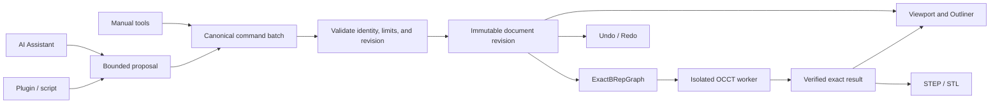

# Ketchup

<p align="center">
  
</p>

<p align="center">
  <strong>Open-source 2D/3D parametric modeling with exact geometry and safe, undoable AI.</strong>
</p>

<p align="center">
  Windows x86-64 · Rust · Open CASCADE Technology · wgpu · Apache-2.0
</p>

Ketchup is an AI-native desktop modeler for creating, editing, assembling, validating, and exporting real geometry. Manual tools and the Assistant share the same canonical command path: every accepted model change is validated, revision-bound, atomic, and undoable.

> **Development status:** Ketchup is a working prototype, not yet a stable general-purpose CAD release. The repository contains substantial end-to-end modeling workflows, but broad format compatibility, installers, production polish, and a stable public API are still in progress.

<p align="center">
  
</p>

## What you can do today

| Model | Organize and edit | Deliver |
|---|---|---|
| Draw line, arc, circle, and rectangle geometry; evaluate represented cubic Bézier sketch curves | Reuse definitions through occurrences and components | Save checksummed `.ketchup` documents with recovery support |
| Extract bounded regions, including profiles with holes | Move, copy, rotate, align, distribute, group, and Make Unique | Import reviewed STEP, STL, DXF, and `.kscene` subsets |
| Push/Pull, pocket, revolve, sweep, loft, shell, fillet, chamfer, and offset | Build linear, rectangular, and circular patterns | Export current exact geometry to STEP and tessellation to STL |
| Run exact cut, union, intersect, and split operations | Edit ordered feature history, dimensions, visibility, and active bodies | Persist drawing sheets that generate Front/Top/Right assembly views |
| Constrain sketches with dimensional and geometric relationships | Assemble rigid occurrences with stable-reference mates | Inspect validation, loss, reference-health, and failure diagnostics |

Advanced operations are intentionally bounded and fail closed when geometry, identity, resource, or worker guarantees cannot be met. This table describes tested product paths, not unrestricted support for every shape or imported model.

## A real example: an articulated drawer assembly

Open [`examples/hettich-quadro-v6-drawer.ketchup`](examples/hettich-quadro-v6-drawer.ketchup) with **File → Open**.

The document combines an editable assembly with embedded exact STEP components, reusable occurrences, stable mechanical references, joints, travel limits, a coordinated motion study, and a persisted mounting/mechanical contract. It is a compact example of what Ketchup is becoming: not just a shape viewer, but a model whose geometry and engineering intent stay connected.

Other included scenes:

| Example | Try it for |
|---|---|
| [`grooved-beam-array.ketchup`](examples/grooved-beam-array.ketchup) | A 480-occurrence timber stress scene with 24 shared definitions; useful for viewport, selection, Outliner, and instancing behavior. |
| [`assistant-ketchup-squeeze-bottle.ketchup`](examples/assistant-ketchup-squeeze-bottle.ketchup) | A saved Assistant-authored squeeze-bottle showcase. |
| [`assistant-rounded-teapot.ketchup`](examples/assistant-rounded-teapot.ketchup) | A rounded multi-part teapot showcase. |
| [`assistant-balloon-letters.ketchup`](examples/assistant-balloon-letters.ketchup) | Inflated balloon-style lettering and organic mesh presentation. |

The three visual showcase files contain authored mesh geometry; they demonstrate document, Assistant, viewport, framing, and persistence workflows rather than unrestricted exact freeform modeling.

## One path from intent to geometry



Assistant model proposals cannot write around validation, persistence, or Undo/Redo. Stale, invalid, oversized, timed-out, or disconnected proposals are rejected without replacing the last valid model.

## Modeling capabilities

### Sketching and parametric history

- Principal, offset, and planar-face workplanes.
- Line, arc, circle, and cubic Bézier entities with deterministic region extraction and holes.
- Bounded geometric solving for horizontal, vertical, coincident, distance, radius, fixed-point, parallel, perpendicular, tangent, angle, equal, symmetric, concentric, collinear, midpoint, and point-on-curve constraints.
- Ordered body/feature history, dimensional edits, hole/slot repositioning, feature suppression/resume, and multi-body activation.

### Exact geometry

Exact bodies are evaluated through a supervised, versioned worker backed by Open CASCADE Technology. Current bounded operation families include extrusion, pocket, Boolean cut/union/intersect/split, revolve, sweep, loft, shell, fillet, chamfer, and signed planar offset. Accepted results carry freshness and topology evidence before they can drive rendering, picking, or export.

### Assemblies and drawings

Ketchup supports reusable occurrences, grounding, stable-reference planar/axial mates, rigid solve diagnostics, fixed/revolute/prismatic joint data, limits, motion studies, collision/clearance checks, and persisted drawing sheets that generate Front/Top/Right visible-line views. This is an evolving assembly path, not yet a complete mechanical simulation or drafting suite.

### Imports and exports

- **STEP:** exact B-Rep import with preserved source bytes and explicit flattening diagnostics.
- **STL:** binary/ASCII import with declared units and strict closed-manifold validation; no silent repair.
- **DXF:** reviewed bounded 2D geometry subset with a loss report.
- **SketchUp bridge:** open `.kscene` interchange subset rather than native `.skp` parsing.
- **Export:** current visible exact model to STEP and current tessellation to STL, both with fail-closed freshness/loss checks.

## AI Assistant

The docked Assistant receives bounded document and selection context and can inspect a model, explain a plan, create supported sketches and parts, append exact features, edit dimensions, transform or copy occurrences, build patterns, and submit reviewed changes. Conversations and searchable project memory can be stored with the document.

The normal application build includes the private OAuth provider surface and defaults to Codex OAuth with GPT-5.6. That OAuth path requires a separate external adapter that is not distributed in this public repository. A repository-complete public build can instead use the API-key providers:

```powershell
cargo run -p ketchup-app --no-default-features
```

Set `OPENAI_API_KEY` or `ANTHROPIC_API_KEY`, then choose the matching provider in the Assistant. Cloud AI is optional; ordinary modeling remains available without it.

## Build and run

The supported development platform is **Windows x86-64** with Rust 1.97.0 and OCCT 8.0.1. See the [Windows toolchain guide](docs/toolchain/WINDOWS.md) for the pinned native environment.

```powershell
cargo build -p ketchup-scheduler --bin ketchup-exact-worker
cargo run -p ketchup-app
```

Run the public API-key build without the private OAuth adapter:

```powershell
cargo run -p ketchup-app --no-default-features
```

Validate the workspace:

```powershell
cargo test --locked --workspace --all-targets -- --test-threads=1
cargo clippy --workspace --all-targets --all-features -- -D warnings
cargo fmt --all -- --check
```

No stable public API or long-term native file-format compatibility is promised yet. Undo/Redo history is currently session-local; saved documents preserve the validated snapshot, not the in-memory history stack.

## Architecture

Ketchup has one canonical, revisioned document and one validated mutation gateway. Geometry workers, rendering, picking, drawings, validation, imports, exports, UI, plugins, and AI are projections or clients of that authority rather than parallel model stores.

Read project authority in this order:

1. [Accepted ADRs](docs/adr) for the decisions they own.
2. The frozen [execution contract](docs/architecture/EXECUTION_CONTRACT.md) for binding invariants.
3. The retained consolidated [Architecture Specification V4c](KETCHUP_ARCHITECTURE_SPECIFICATION_V4c.md) for the latest architecture review snapshot. Its evidence baseline is historical; current capability claims come from the present code and tests, and proposed post-contract decisions remain non-binding until accepted by ADR.
4. The [interaction specification](docs/design/README.md) and [workflow-led implementation plan](docs/design/IMPLEMENTATION_PLAN.md) for UI behavior and delivery order.

Earlier root-level architecture drafts were removed from the current tree to avoid competing definitions; their history remains available in Git. Historical gate evidence and the original [R0 baseline](R0_LICENSE_AND_TOOLCHAIN_BASELINE.md) remain unchanged for provenance.

## Direction

Current development is focused on turning bounded vertical slices into reusable, role-neutral CAD operation families: broader typed profiles and paths, stronger stable-reference behavior, more general multi-selection, richer exact fabrication projections, and fewer legacy named-product branches. UI polish and additional platform packaging follow functional correctness and deterministic failure behavior.

## License

Ketchup is licensed under the [Apache License 2.0](LICENSE).
